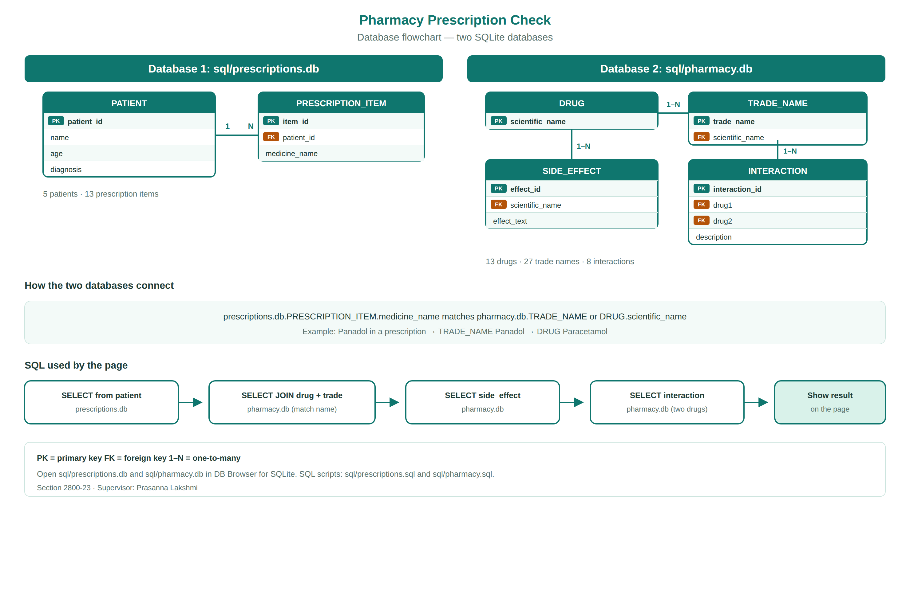
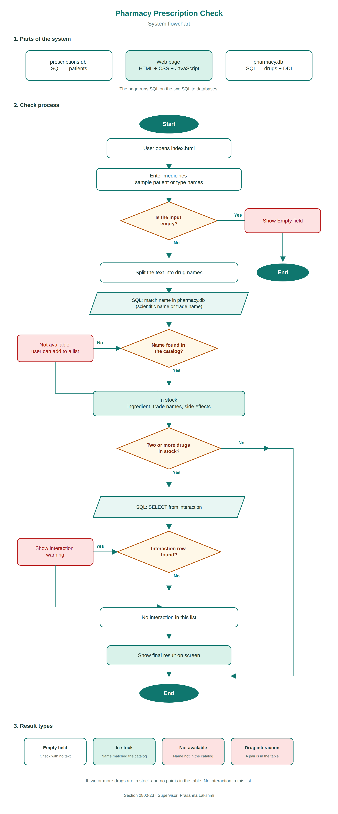

# Project Document

**Project title:** Matching a medical prescription with a pharmacy list

**Section:** 2800-23

**Supervisor:** Prasanna Lakshmi

**Date:** September 2026

## Team members

- Norah Saeed Alqahtani (445804256)
- Noura Hamad Hasan (445804642)
- Rawan Ali Almeshary (445804606)
- Wejdan Bandar (444820762)
- Zinah Ibrahem Saeed (445804594)

---

## 1. Introduction

The user enters medicines from a prescription. The program checks if they exist in the pharmacy SQLite database. If the medicine is there, it shows the scientific name, trade names, side effects, and any drug-drug interaction when there are two or more drugs. If it is not there, it shows “not available”.

The site is in English. Drug names stay as pharmacies write them (Panadol, Adol, …).

The project uses two SQLite databases. The check page runs SQL (SELECT / JOIN) on those databases.

The data is a small academic sample. It is not medical advice.

---

## 2. Objective

One main flow:

enter prescription → SQL match with pharmacy database → show result

Flowchart images (not website pages):

- `images/system-flowchart.png` — check process
- `images/database-flowchart.png` — the two SQL databases

---

## 3. System components

| Part | What it does |
| --- | --- |
| `index.html` | Check page (patients, input, results) |
| `sql/prescriptions.db` | SQLite database 1: patients and prescription items |
| `sql/pharmacy.db` | SQLite database 2: drugs, trade names, side effects, interactions |
| `sources/` | Attached CSV datasets used to build the SQL databases |
| `js/database.js` | Opens the databases and runs SQL |
| `js/match.js` | Splits the text and calls the SQL lookups |
| `js/app.js` | Buttons and showing the result |
| `css/style.css` | Page look |
| `images/system-flowchart.png` | System flowchart for the report |
| `images/database-flowchart.png` | Database flowchart for the report |

---

## 4. Datasets

The CSV source files are attached in `sources/`. SQLite is built from those files (`python3 sql/build_from_sources.py`). The full Kaggle dumps are large; the attached CSVs keep the published columns and a working sample.

### Medical prescriptions → `sources/medical_prescription_dataset.csv` → prescriptions.db

Source: [Medical Prescription Dataset](https://www.kaggle.com/datasets/mmumairkhattak/medical-prescription-dataset)

10 patients (P1–P10). Each row is one prescribed medicine, with dosage, frequency, hospital, and date.

### Drug–drug interactions → `sources/drug_drug_interactions.csv` → pharmacy.db

Source: [Drug-Drug Interactions](https://www.kaggle.com/datasets/mghobashy/drug-drug-interactions)

Columns: Drug 1, Drug 2, Interaction Description.

### Pharmacy catalog → `sources/pharmacy_catalog.csv` and `sources/drug_side_effects.csv`

Scientific names, trade names used in KSA, and side effects for the stock list.

---

## 5. Databases

The application has two SQLite databases.

Insert this image in the report:

File: `images/database-flowchart.png`

| Database | Tables |
| --- | --- |
| `sql/prescriptions.db` | PATIENT, PRESCRIPTION_ITEM |
| `sql/pharmacy.db` | DRUG, TRADE_NAME, SIDE_EFFECT, INTERACTION |

A patient has many prescription items. A drug has many trade names, many side effects, and can appear in many interaction rows. The page matches a typed medicine name with `SELECT` + `JOIN` on `scientific_name` or `trade_name`.

Open the `.db` files in DB Browser for SQLite. The same schema is in `sql/prescriptions.sql` and `sql/pharmacy.sql`.

---

## 6. Flow

Insert this image in the report:

File: `images/system-flowchart.png`

1. User types a drug name or a full prescription, or clicks a sample patient (loaded from `prescriptions.db`).
2. Program splits the text (comma or new line).
3. Each name is matched with a SQL query on `pharmacy.db`.
4. Found → show drug, active ingredient, side effects (from SQL).
5. Two or more found drugs → `SELECT` from the interaction table.
6. Not found → not available, and the user can add it to a list on the same page.

---

## 7. Limitations

- Small sample only, not the full Kaggle files.
- Name matching is simple (same name, ignoring capital letters).
- Academic project, not a hospital system.

---

## 8. How to run

Open `index.html` in Chrome or Safari (double-click the file).

To view the tables, open `sql/prescriptions.db` and `sql/pharmacy.db` in DB Browser for SQLite.
